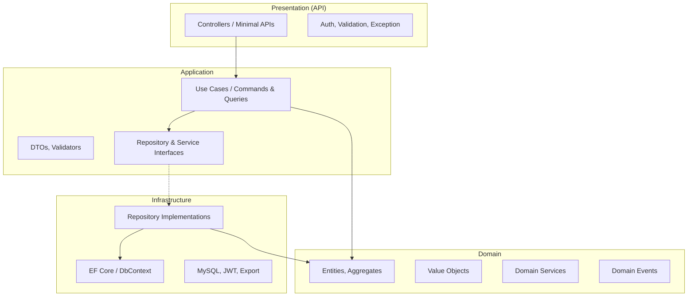
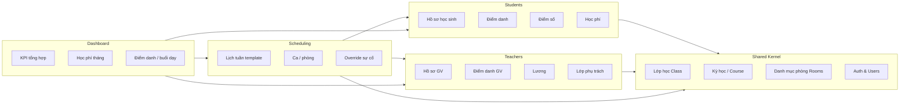
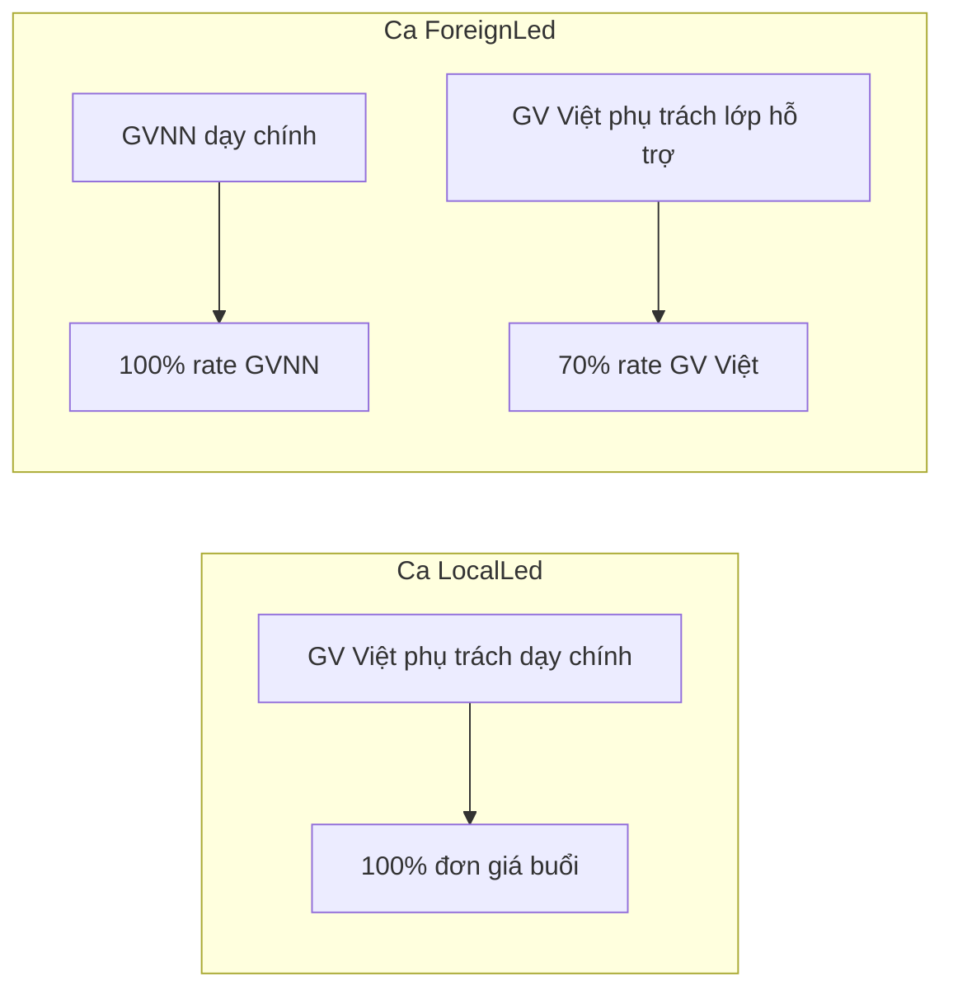
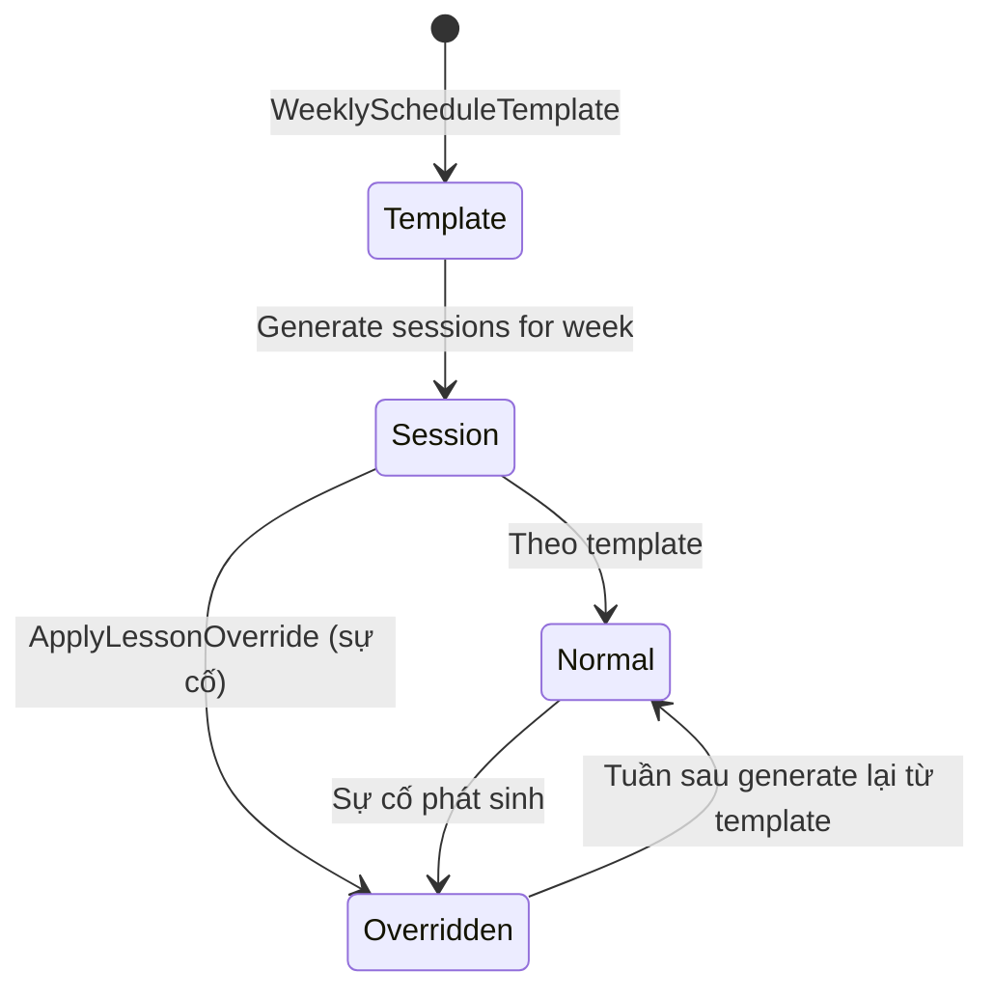
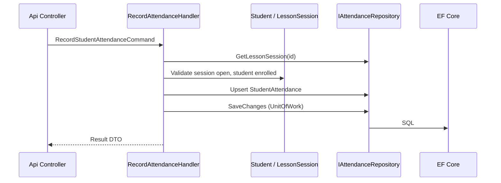

# Kiến trúc hệ thống — English Center Backend

> **Cập nhật:** 2026-06-01  
> **Stack hiện tại:** .NET 8, ASP.NET Core Web API, Swagger  
> **Mô hình:** Clean Architecture (Onion Architecture)

---

## 1. Tổng quan

Hệ thống backend phục vụ **quản lý trung tâm tiếng Anh**, gồm ba khối nghiệp vụ chính:

| Khối | Phạm vi |
|------|---------|
| **Học sinh** | Hồ sơ, lớp học, điểm danh, điểm số, học phí / công nợ |
| **Giáo viên** | Hồ sơ, lương, điểm danh, lớp phụ trách, hợp đồng |
| **Lịch dạy** | Phân công giáo viên–lớp–ca, lịch tuần/tháng, thay đổi / hủy buổi |
| **Dashboard** | Tổng hợp KPI: học sinh, điểm danh, học phí, buổi dạy, lương dự kiến |

API được tổ chức theo **Clean Architecture**: phụ thuộc hướng vào trong (từ ngoài vào **Domain**), tách rõ **nghiệp vụ** và **hạ tầng** (DB, file, email, thanh toán).



### 1.1 Quyết định đã xác nhận

| Hạng mục | Quyết định |
|----------|------------|
| **Cơ sở dữ liệu** | **MySQL** (EF Core + Pomelo) |
| **Xác thực** | **JWT Bearer** + **role** (policy-based authorization) |
| **Phạm vi triển khai** | **Một trung tâm** (single-tenant, không đa chi nhánh) |
| **Học phí** | Thu **theo tháng**; ghi nhận **thanh toán trực tiếp** (tiền mặt/chuyển khoản thủ công). **Chưa** tích hợp cổng thanh toán trực tuyến |
| **Lương giáo viên** | Tính **theo buổi/ca**. Một lớp có thể **nhiều ca/tuần**; ca **do GVNN dạy chính** → GVNN lương **đủ buổi**, GV Việt phụ trách lớp **hỗ trợ** → **70%** lương buổi đó. Ca do GV Việt dạy chính → **100%** |
| **Danh mục phòng** | Bảng **`rooms`** — quản lý danh sách phòng học (mã, tên, sức chứa, trạng thái) dùng khi xếp lịch |
| **Lịch dạy** | **Lặp hàng tuần** (template). Chỉ đổi khi **sự cố** (override theo ngày/buổi); sau sự cố **trở lại lịch chuẩn** (không sửa template vĩnh viễn trừ khi admin cập nhật) |
| **Điểm số** | **Tùy chọn**, không cố định thang điểm; lớp có thể không dùng điểm |
| **Dashboard** | **Có** — API tổng hợp cho màn hình tổng quan |
| **Thông báo** | **Chưa** triển khai (email/SMS/Zalo) |

### 1.2 Quyết định bổ sung (2026-06-01)

| Hạng mục | Quyết định |
|----------|------------|
| **Ghi danh** | **1 học sinh = 1 lớp** tại một thời điểm (không học 2 lớp song song) |
| **Học phí** | **Không** tự sinh hóa đơn. Admin **nhập tay** khoản thu khi nhận tiền → hệ thống tính đã nộp / còn nợ theo tháng |
| **Lương GV** | **Cố định theo hợp đồng từng GV** (vd. 300k/buổi), **không** theo lớp. Tổng tuần = `rate × số buổi dạy`. Ca `ForeignLed`: GV Việt hỗ trợ = **70%** rate **của chính GV đó** (300k → 210k) |
| **Sinh buổi học** | Job nền tự chạy, generate trước **1 tháng** |
| **Auth** | Custom `users` + JWT (**không** full Identity). **Username** + password. Access **30 phút**, refresh **1 ngày** |
| **API list** | Paging: `page`, `pageSize` ∈ **10, 20, 50, 100**. Sort mặc định **`updated_at` DESC**. Filter/search làm sau |
| **ID** | Mọi PK = **GUID** (`CHAR(36)`) |
| **Upload file** | Chưa cần |
| **Dashboard** | Mặc định **tháng hiện tại**, có **so sánh tháng trước** |
| **Mã HS / GV / lớp** | **Tự sinh** server = chuỗi **GUID** (cùng lúc tạo `id`); client **không** gửi `code` khi tạo |
| **Học phí kỳ vọng** | `student_tuition_months.expected_amount` = `enrollment.monthly_tuition_amount` (fallback `classes.default_monthly_tuition` nếu NULL) |
| **API** | **RESTful** — xem [api-overview.md](./api-overview.md) |

---

## 2. Cấu trúc solution đề xuất

Chuyển từ single-project sang **multi-project** để thể hiện ranh giới layer:

```
EnglishCenter.Backend/
├── src/
│   ├── EnglishCenter.Domain/              # Lõi: không phụ thuộc framework
│   ├── EnglishCenter.Application/         # Use cases, interfaces, mapping
│   ├── EnglishCenter.Infrastructure/      # EF Core, repos, external services
│   └── EnglishCenter.Api/                 # Web API (entry point)
├── tests/
│   ├── EnglishCenter.Domain.Tests/
│   ├── EnglishCenter.Application.Tests/
│   └── EnglishCenter.Api.IntegrationTests/
└── docs/
    └── ARCHITECTURE.md
```

### Quy tắc phụ thuộc (Dependency Rule)

| Project | Được tham chiếu | Không được tham chiếu |
|---------|-----------------|------------------------|
| **Domain** | *(không project nào)* | Application, Infrastructure, Api |
| **Application** | Domain | Infrastructure, Api |
| **Infrastructure** | Application, Domain | Api *(trừ khi đăng ký DI từ Api)* |
| **Api** | Application, Infrastructure | — |

**Domain** và **Application** không import `Microsoft.EntityFrameworkCore`, `AspNetCore`, v.v.

---

## 3. Chi tiết từng layer

### 3.1 Domain (Lõi nghiệp vụ)

Chứa **luật nghiệp vụ thuần túy**, không biết HTTP hay SQL.

**Thành phần:**

- **Entities / Aggregates:** đối tượng có định danh (`Student`, `Teacher`, `Class`, `ScheduleSlot`, …)
- **Value Objects:** không định danh (`Money`, `DateRange`, `Score`, `PhoneNumber`)
- **Enums:** `TeacherType` (`Local`, `Foreign` — phân loại hồ sơ, **không** quyết định hệ số 70%), `TeachingMode` (`LocalLed`, `ForeignLed`), `SessionStaffRole` (`PrimaryInstructor`, `LocalSupport`), `AttendanceStatus`, `PaymentMethod`, …
- **Domain Services:** `TuitionMonthStatusCalculator`, `LessonSalaryCalculator`, `ScheduleConflictChecker`, `LessonSessionGenerator`
- **Domain Events:** `StudentEnrolled`, `LessonCancelled`, `TuitionPaymentRecorded`, `SalaryPeriodClosed`
- **Exceptions:** `ScheduleConflictException`, `InsufficientPaymentException`

**Ví dụ aggregate gốc:**

```
Student (root)
├── Enrollments → Class
├── AttendanceRecords → LessonSession
├── Grades → Assessment (tùy chọn)
└── StudentTuitionMonths → TuitionPayments

Teacher (root)
├── ClassAssignments → Class (GV phụ trách lớp — thường là Local, Main)
├── TeacherLessonRates → đơn giá hợp đồng / buổi (nguồn duy nhất cho lương)
├── LessonPayRecords → LessonSessionStaff (lương theo vai trò trong buổi)
└── SalaryPeriodSummaries

Class (root)
├── Students (qua Enrollment)
├── AssignedTeachers (homeroom / assistant)
├── WeeklyScheduleTemplates → Room, TeachingMode, GV ca đó
└── LessonSessions → LessonSessionStaff (1–2 GV/buổi)

Room (catalog)
└── WeeklyScheduleTemplates / LessonSessions
```

### 3.2 Application (Use cases)

Điều phối luồng nghiệp vụ; **không** chứa SQL hay `HttpContext`.

**Thành phần:**

- **Commands / Queries** (CQRS tùy chọn): `RecordStudentAttendanceCommand`, `GetTeacherScheduleQuery`
- **Handlers:** xử lý một use case, gọi repository qua interface
- **DTOs:** input/output cho API
- **Validators:** FluentValidation
- **Interfaces:** `IStudentRepository`, `IUnitOfWork`, `ICurrentUser`, `IDashboardReadRepository`
- **Mapping:** AutoMapper hoặc manual mapper Application ↔ Domain

**Ví dụ use case theo module:**

| Module | Command / Query |
|--------|-----------------|
| Học sinh | `CreateStudent`, `EnrollStudentInClass`, `RecordAttendance`, `SubmitGrade` (tùy chọn), `RecordTuitionPayment` |
| Danh mục | `CreateRoom`, `UpdateRoom`, `ListRooms` |
| Giáo viên | `CreateTeacher`, `AssignTeacherToClass`, `SetTeacherLessonRate`, `RecordTeacherAttendance`, `CalculateLessonSalary`, `CloseSalaryPeriod` |
| Lịch dạy | `CreateWeeklyScheduleTemplate`, `GenerateLessonSessionsForMonth` (job), `ApplyLessonOverride` |
| Dashboard | `GetDashboardSummary` (tháng T + so sánh T-1), `GetTuitionOverview`, … |
| Auth | `Login`, `RefreshToken`, `Logout` |

### 3.3 Infrastructure (Hạ tầng)

Triển khai chi tiết kỹ thuật.

- **Persistence:** EF Core 8 + **Pomelo.EntityFrameworkCore.MySql**, `DbContext`, migrations
- **Repositories:** implement interface từ Application
- **Auth:** Custom `users` / `roles` + **JWT** + bảng `refresh_tokens`
- **Background job:** `IHostedService` hoặc Hangfire — `GenerateLessonSessionsJob` (rolling 1 tháng)
- **Export (dashboard / báo cáo):** Excel/PDF qua thư viện (ClosedXML, QuestPDF) — giai đoạn sau nếu cần
- **Clock / ID:** `ISystemClock`, `IGuidGenerator` cho test

**Connection string (ví dụ):**

```json
"ConnectionStrings": {
  "Default": "Server=localhost;Port=3306;Database=english_center;User=app;Password=***;"
}
```

### 3.4 Presentation — Api

- **Controllers** hoặc **Minimal APIs** — mỏng, chỉ map HTTP → Command/Query
- **Middleware:** exception handling, correlation id, logging
- **Filters:** authorization theo role
- **DI composition root:** đăng ký services từ Application + Infrastructure
- **Swagger / OpenAPI**

---

## 4. Bounded Context & module nghiệp vụ

Chia theo **module** trong Application/Domain (có thể tách folder, sau này tách microservice nếu cần):



### 4.1 Quản lý học sinh

| Chức năng | Mô tả ngắn | Entity / VO chính |
|-----------|------------|-------------------|
| Hồ sơ | Thông tin cá nhân, phụ huynh, trạng thái | `Student`, `Guardian` |
| Ghi danh lớp | Học sinh ↔ lớp, ngày bắt đầu/kết thúc | `Enrollment` |
| Điểm danh | Theo buổi học (`LessonSession`) | `StudentAttendance` |
| Điểm số *(tùy chọn)* | Bài kiểm tra / nhận xét; không bắt buộc thang 10 hay 100 | `Assessment`, `Grade` |
| Học phí | Theo tháng; admin **nhập tay** khi thu tiền | `StudentTuitionMonth`, `TuitionPayment` |

**Quy tắc nghiệp vụ:**

- **Một học sinh chỉ một enrollment `Active`** — khi ghi danh lớp mới phải kết thúc lớp cũ
- Không ghi điểm danh cho buổi đã hủy (`LessonSession.Status = Cancelled`)
- **Không** job/tự động tạo hóa đơn. Admin thu tiền → `RecordTuitionPayment` (số tiền, tháng, phương thức)
- `expected_amount` tháng = **`enrollment.monthly_tuition_amount`**; nếu NULL → `classes.default_monthly_tuition`
- **Trạng thái tháng:** `Unpaid` / `Partial` / `Paid` = so sánh `SUM(payments)` với `expected_amount`
- Có thể nhiều lần nhập tiền trong cùng tháng (trả góp)
- Lớp có `GradingEnabled = false` → không tạo `Assessment` / `Grade`
- `Assessment.MaxScore` và `Grade.Score` **nullable** — cho phép chỉ nhận xét (`Comment`) không có số
- Học sinh `Inactive` không xuất hiện trong danh sách điểm danh mặc định

### 4.2 Danh mục phòng (`rooms`)

Danh mục master data: biết trung tâm có **những phòng nào** trước khi xếp lịch.

| Chức năng | Mô tả |
|-----------|--------|
| CRUD phòng | Mã phòng, tên, sức chứa, tầng/khu, ghi chú, `is_active` |
| Tra cứu | Lọc phòng đang dùng; gợi ý phòng trống theo khung giờ (conflict checker) |

- Mỗi **ca học** (`WeeklyScheduleTemplate`) và **buổi học** (`LessonSession`) gắn `room_id` từ danh mục.
- Không xóa cứng phòng đã có lịch; dùng `is_active = false`.

---

### 4.3 Quản lý giáo viên

| Chức năng | Mô tả ngắn | Entity chính |
|-----------|------------|--------------|
| Hồ sơ | `TeacherType`: Local / Foreign (phân loại, báo cáo) | `Teacher` |
| Lớp phụ trách | GV Việt **phụ trách lớp** (homeroom) — thường `ClassAssignment.Main` | `ClassAssignment` |
| Đơn giá buổi | Mức lương/buổi **riêng từng GV** (GVNN thường có rate khác) | `TeacherLessonRate` |
| Điểm danh GV | Theo buổi + **vai trò** trong buổi | `TeacherAttendance` |
| Lương | Một buổi có thể **2 dòng lương** (GVNN + GV hỗ trợ) | `LessonPayRecord`, `LessonSessionStaff` |

**Mô hình ca học & lương (đã xác nhận):**

Ví dụ: **1 lớp, 2 ca/tuần** — Thứ 3 ca Việt, Thứ 5 ca GVNN.



| `TeachingMode` | GV trên buổi | Vai trò | Hệ số lương |
|----------------|--------------|---------|-------------|
| `LocalLed` | GV Việt (phụ trách lớp) | `PrimaryInstructor` | **1.0** × `teacher.lesson_rate` |
| `ForeignLed` | GVNN | `PrimaryInstructor` | **1.0** × `teacher.lesson_rate` (GVNN) |
| `ForeignLed` | GV Việt phụ trách lớp | `LocalSupport` | **0.7** × `teacher.lesson_rate` (GV Việt) |

**Ví dụ lương cố định (hợp đồng 300k/buổi):**

- 2 lớp × 2 ca/tuần = **4 buổi/tuần** → 4 × 300k = **1,2tr/tuần** (nếu cả 4 buổi đều `LocalLed`, GV dạy chính).
- 1 buổi trong tuần là ca `ForeignLed`, GV Việt chỉ hỗ trợ → buổi đó: **210k** (70% × 300k); các buổi `LocalLed` vẫn 300k.

- **Lương không phụ thuộc lớp** — chỉ phụ thuộc **hợp đồng GV** + **số buổi** + **vai trò trong buổi**.
- `LessonSalaryCalculator`: `base_rate` = `teacher_lesson_rates` hiệu lực của **đúng `teacher_id`** trên dòng staff.
- Mỗi `LessonSession` `Completed` → sinh `LessonPayRecord` theo `LessonSessionStaff` có điểm danh.
- Một GV không trùng lịch hai lớp cùng khung giờ (kể cả Primary và Support).
- `CloseSalaryPeriod`: chốt tháng; sau chốt không sửa `LessonPayRecord` (admin reversal + audit).

### 4.4 Quản lý lịch dạy

| Chức năng | Mô tả | Entity chính |
|-----------|-------|--------------|
| Lịch chuẩn | Thứ, giờ, **phòng** (`room_id`), `TeachingMode`, GV ca đó — **lặp hàng tuần** | `WeeklyScheduleTemplate` |
| Buổi học cụ thể | Instance theo ngày + staff buổi | `LessonSession`, `LessonSessionStaff` |
| Sự cố | Đổi GV / phòng / hủy **một buổi**; không đổi template | `LessonScheduleOverride` |

**Quy tắc nghiệp vụ — lịch tuần & sự cố:**



- `WeeklyScheduleTemplate` là **nguồn sự thật** (vd: Thứ 3 `LocalLed` phòng A; Thứ 5 `ForeignLed` phòng A + GVNN + GV Việt hỗ trợ)
- Một lớp = **nhiều template** (nhiều ca/tuần), mỗi ca một `teaching_mode`
- **`GenerateLessonSessionsJob`** (nền): mỗi ngày/quý định, sinh buổi từ template cho **30 ngày tới** (rolling 1 tháng)
- Khi có sự cố: tạo `LessonScheduleOverride` gắn **một** `LessonSession` (đổi giáo viên, giờ, phòng, hoặc `Cancelled`)
- **Không** cập nhật template khi xử lý sự cố → tuần sau buổi mới vẫn theo template (trở lại như cũ)
- Admin muốn đổi lịch **vĩnh viễn** → sửa `WeeklyScheduleTemplate` (use case riêng, có audit)
- `IScheduleConflictChecker`: trùng phòng, trùng GV, trùng lớp khi tạo template hoặc override

### 4.5 Dashboard

API read-only, tổng hợp dữ liệu cho màn hình quản lý (frontend vẽ biểu đồ).

| Chỉ số gợi ý | Nguồn dữ liệu |
|--------------|---------------|
| Tổng học sinh active / mới trong tháng | `Student`, `Enrollment` |
| Tỷ lệ điểm danh học sinh (tuần/tháng) | `StudentAttendance` / `LessonSession` |
| Học phí tháng T (+ so sánh T-1) | `StudentTuitionMonth`, `TuitionPayment` |
| Số buổi dạy trong tháng / theo giáo viên | `LessonSession`, `TeacherAttendance` |
| Lương GV dự kiến tháng hiện tại | `LessonPayRecord` (chưa chốt) |

Triển khai bằng **query handlers** riêng (`Dashboard` module), có thể dùng raw SQL hoặc projection EF cho hiệu năng; **không** đặt logic tổng hợp trong Controller.

---

## 5. Mô hình dữ liệu (khái niệm ERD)

```mermaid
erDiagram
    Student ||--o{ Enrollment : has
    Class ||--o{ Enrollment : contains
    Class ||--o{ ClassAssignment : assigns
    Teacher ||--o{ ClassAssignment : teaches
    Class ||--o{ LessonSession : schedules
    LessonSession ||--o{ StudentAttendance : records
    LessonSession ||--o{ TeacherAttendance : records
    Student ||--o{ Grade : receives
    Assessment ||--o{ Grade : defines
    Student ||--o{ StudentTuitionMonth : tracks
    StudentTuitionMonth ||--o{ TuitionPayment : paid_by
    Teacher ||--o{ LessonPayRecord : earns
    LessonSession ||--o| LessonPayRecord : pays
    SalaryPeriod ||--o{ LessonPayRecord : groups
    Room ||--o{ WeeklyScheduleTemplate : hosts
    Class ||--o{ WeeklyScheduleTemplate : defines
    LessonSession ||--o{ LessonSessionStaff : staffs
    Teacher ||--o{ LessonSessionStaff : assigned
    LessonSession }o--|| WeeklyScheduleTemplate : from
    LessonSession ||--o| LessonScheduleOverride : may_have
```

> Chi tiết bảng, cột và index: [DATABASE.md](./DATABASE.md). EF Configurations trong `Infrastructure/Persistence/`.

---

## 6. Luồng xử lý điển hình

### 6.1 Ghi điểm danh học sinh



### 6.2 Sinh buổi học từ lịch tuần

1. `CreateWeeklyScheduleTemplate` — thiết lập lịch lặp (thứ, giờ, phòng, GV mặc định)  
2. `GenerateLessonSessionsJob` — tạo `LessonSession` cho **30 ngày tới** từ template  
3. Nếu sự cố: `ApplyLessonOverride` trên **một** session → không đổi template  
4. Tuần kế tiếp: bước 2 đọc lại template → lịch trở về chuẩn  

### 6.3 Chốt lương giáo viên theo buổi (tháng)

1. Liệt kê `LessonSession` `Completed` trong `SalaryPeriod`  
2. Với mỗi `LessonSessionStaff` có điểm danh hợp lệ → `LessonSalaryCalculator`  
3. `base_rate` từ hợp đồng GV; `pay_amount = base_rate × pay_multiplier` (0.7 nếu `LocalSupport` + `ForeignLed`)  
4. Lưu **một hoặc hai** `LessonPayRecord` / buổi (GVNN full + GV Việt hỗ trợ 70% nếu có)  
5. `CloseSalaryPeriod` — khóa sửa, tổng hợp báo cáo lương  

### 6.4 Thu học phí (admin nhập tay)

1. Admin chọn học sinh + tháng (`billing_year`, `billing_month`)  
2. `RecordTuitionPayment` — nhập `amount`, `payment_method`, ghi chú  
3. Upsert `StudentTuitionMonth` (lazy): set `expected_amount` từ enrollment, cộng `amount_paid`, tính `Unpaid` / `Partial` / `Paid`  
4. **Không** có bước sinh hóa đơn tự động  

---

## 7. API & bảo mật

**Chuẩn RESTful** — resource-oriented, đúng HTTP verb/status; chi tiết: [api-overview.md](./api-overview.md) §1.0.

- Base: `/api/v1`
- Danh từ số nhiều, `kebab-case`, **không** động từ trên path (`/login`, `/close`, `/end`)
- Thay đổi trạng thái: **`PATCH`** resource; tạo con: **`POST`** collection; thay thế: **`PUT`**

| Nhóm | Ví dụ REST |
|------|------------|
| Auth | `POST /auth/tokens`, `DELETE /auth/tokens` |
| Students | `GET/POST /students`, `GET /students/{id}/enrollments` |
| Classes | `GET/POST /classes`, `POST /classes/{id}/enrollments` |
| Enrollments | `PATCH /enrollments/{id}` (kết thúc ghi danh) |
| Lessons | `GET /lesson-sessions`, `PUT /lesson-sessions/{id}/schedule-override` |
| Tuition | `GET /student-tuition-months`, `POST /students/{id}/tuition-payments` |
| Salary | `GET /salary-periods`, `PATCH /salary-periods/{id}` |
| Dashboard | `GET /dashboard/summary` |

**Auth (đã chọn): Custom JWT**

| Thành phần | Chi tiết |
|------------|----------|
| Đăng nhập | **`username`** + `password` |
| Access token | JWT, **30 phút** |
| Refresh token | Lưu `refresh_tokens`, **1 ngày**, rotate khi refresh |
| Password | BCrypt hoặc `PasswordHasher` (không cần full Identity UI) |

- Claims: `sub`, `username`, `role`
- Api: `[Authorize(Roles = "...")]` / policy

**Vai trò gợi ý:**

| Role | Quyền chính |
|------|-------------|
| `Admin` | Toàn quyền cấu hình |
| `AcademicStaff` | Lớp, lịch, điểm danh, điểm (nếu bật) |
| `Accountant` | Học phí, thanh toán, chốt lương |
| `Teacher` | Xem lịch dạy, điểm danh lớp được phân công |
| `Receptionist` | Hồ sơ học sinh, ghi nhận thanh toán |

→ Policy-based authorization trong Api; role lấy từ JWT, không tin role gửi từ client body.

### 7.1 Quy ước API danh sách (paging / sort)

**Query chung** (mọi `GET` trả về list):

| Param | Mặc định | Ghi chú |
|-------|----------|---------|
| `page` | `1` | ≥ 1 |
| `pageSize` | `20` | Chỉ nhận **10, 20, 50, 100** |
| `sortBy` | `updatedAt` | Whitelist theo từng resource |
| `sortDir` | `desc` | `asc` \| `desc` |

**Response bọc:**

```json
{
  "items": [ ],
  "page": 1,
  "pageSize": 20,
  "totalCount": 150,
  "totalPages": 8
}
```

- **Filter / search:** phase sau; chuẩn bị `?search=` hoặc field riêng từng API.
- Mọi bảng nghiệp vụ cập nhật `updated_at` khi sửa để sort “gần nhất”.

---

## 8. Cross-cutting concerns

| Concern | Cách xử lý |
|---------|------------|
| **Validation** | FluentValidation trong Application; filter trả 400 + ProblemDetails |
| **Logging** | Serilog, structured log, correlation id |
| **Exception** | Global exception middleware → RFC 7807 Problem Details |
| **Transaction** | `IUnitOfWork` / `SaveChangesAsync` mỗi command |
| **Caching** | Redis (tùy chọn) cho dashboard & lịch tuần |
| **Thông báo** | *Không triển khai giai đoạn hiện tại* |
| **Audit** | `CreatedAt`, `CreatedBy`, `ModifiedAt` trên entity hoặc bảng `AuditLog` |

---

## 9. Công nghệ đề xuất (bổ sung cho .NET 8)

| Mục đích | Gợi ý |
|----------|-------|
| ORM | Entity Framework Core 8 |
| DB | **MySQL 8** — `Pomelo.EntityFrameworkCore.MySql` |
| CQRS / Mediator | MediatR |
| Validation | FluentValidation |
| Mapping | AutoMapper hoặc Mapster |
| Auth | **Custom JWT** + `refresh_tokens` + BCrypt |
| Background job | `IHostedService` / Hangfire — sinh buổi học 1 tháng |
| API docs | Swashbuckle (đã có) |
| Test | xUnit + FluentAssertions + Testcontainers.MySql (integration) |

---

## 10. Quy ước mã nguồn

- **Namespace:** `EnglishCenter.{Layer}.{Module}.{Feature}`
- **Một use case = một handler** (file riêng)
- **Repository:** chỉ trả aggregate cần thiết; tránh `IQueryable` lọt ra Application
- **Soft delete:** `IsDeleted` trên entity cần lưu lịch sử (học sinh, hóa đơn)
- **ID:** **luôn `Guid`** (`CHAR(36)` trong MySQL) — không dùng `int` identity cho PK

---

## 11. Lộ trình triển khai gợi ý

| Phase | Nội dung |
|-------|----------|
| **P0** | Tách solution 4 project, DI, Exception middleware, Health check |
| **P1** | Shared: `Class`, `Course`, Auth cơ bản |
| **P2** | Students: hồ sơ, enrollment, điểm danh |
| **P3** | Scheduling: lịch tuần, `LessonSession`, conflict checker |
| **P4** | Teachers: phân công lớp, điểm danh GV |
| **P5** | Học phí tháng + thanh toán trực tiếp; lương theo ca (`TeachingMode`, GV hỗ trợ 70%) |
| **P6** | Điểm tùy chọn; **Dashboard** API |
| **P7** | Export Excel/PDF (nếu cần); cổng thanh toán / thông báo *(tương lai)* |

---

## 12. Phạm vi ngoài giai đoạn hiện tại

Các hạng mục sau **không** nằm trong scope implement ban đầu (có thể mở rộng sau):

- Cổng thanh toán trực tuyến (VNPay, Momo, …)
- Thông báo email / SMS / Zalo
- Đa chi nhánh (multi-branch / multi-tenant)
- SSO / đăng nhập Google, Microsoft

**Giữ nguyên:**

- Backend REST API; frontend riêng
- Message lỗi tiếng Việt; JSON UTF-8
- Điểm danh theo **buổi học** (`LessonSession`)

---

## 13. Tài liệu liên quan (dự kiến)

| File | Mô tả |
|------|-------|
| `docs/DATABASE.md` | Thiết kế bảng MySQL (không FK, index & unique) |
| [api-overview.md](./api-overview.md) | Contract REST `/api/v1` |
| `README.md` | Hướng dẫn chạy local, migration, biến môi trường |

---

*Tài liệu do team backend duy trì. Mọi thay đổi kiến trúc lớn (tách service, đổi DB) cần cập nhật file này trước khi implement.*
