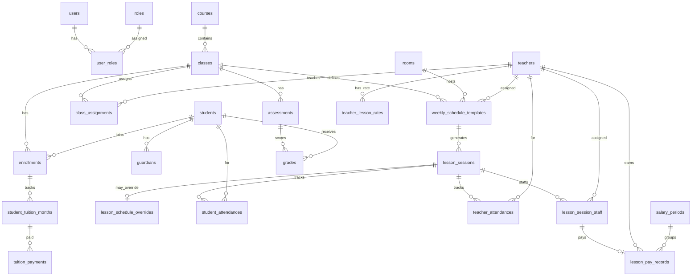

# Thiết kế cơ sở dữ liệu — English Center

> **Cập nhật:** 2026-06-01 (lương cố định/GV; học phí nhập tay; 1 HS 1 lớp; job 1 tháng)  
> **DBMS:** MySQL 8.x  
> **Charset:** `utf8mb4` / `utf8mb4_unicode_ci`  
> **Tham chiếu:** [ARCHITECTURE.md](./ARCHITECTURE.md)

---

## 1. Nguyên tắc thiết kế

| Nguyên tắc | Mô tả |
|------------|--------|
| **Không ràng buộc FK** | Quan hệ chỉ mang tính **logic** (`*_id`). Application / Domain đảm bảo tính toàn vẹn. Thuận tiện scale, shard, hoặc tách DB sau này. |
| **Khóa chính** | `CHAR(36)` — UUID string (ví dụ `uuid()` ở app hoặc `UUID()` MySQL 8). |
| **Đặt tên bảng** | `snake_case`, số nhiều (`students`, `lesson_sessions`). |
| **Đặt tên cột** | `snake_case`. Khóa tham chiếu: `{entity}_id`. |
| **Tiền tệ** | `DECIMAL(18,2)` — đơn vị VND (hoặc cấu hình sau). |
| **Thời gian** | `DATETIME(6)` UTC lưu DB; hiển thị theo timezone app (`Asia/Ho_Chi_Minh`). |
| **Soft delete** | `is_deleted TINYINT(1) DEFAULT 0` + `deleted_at` trên bảng master. |
| **Audit** | `created_at`, `created_by`, `updated_at`, `updated_by` trên bảng nghiệp vụ. |
| **Ràng buộc UNIQUE** | Vẫn dùng **index unique** khi cần (vd. một hóa đơn / học sinh / lớp / tháng) — không bắt buộc phải có FK. |

### 1.1 Toàn vẹn dữ liệu (không FK)

- Trước khi `INSERT`/`UPDATE`, use case kiểm tra bản ghi cha tồn tại và `is_deleted = 0`.
- Job định kỳ (tùy chọn) báo cáo **orphan** `*_id` không khớp.
- Xóa mềm cha: không xóa cứng con; app chặn hoặc cascade logic ở Application layer.

### 1.2 Quy ước kiểu MySQL

```sql
-- Mẫu cột dùng chung (copy vào mỗi bảng khi tạo migration)
created_at     DATETIME(6) NOT NULL DEFAULT CURRENT_TIMESTAMP(6),
created_by     CHAR(36) NULL,
updated_at     DATETIME(6) NULL ON UPDATE CURRENT_TIMESTAMP(6),
updated_by     CHAR(36) NULL,
is_deleted     TINYINT(1) NOT NULL DEFAULT 0,
deleted_at     DATETIME(6) NULL
```

---

## 2. Sơ đồ quan hệ logic (không FK)



---

## 3. Danh mục enum (lưu `TINYINT` hoặc `VARCHAR`)

| Enum | Giá trị | Ghi chú |
|------|---------|---------|
| `user_status` | 0=Inactive, 1=Active | |
| `student_status` | 0=Inactive, 1=Active, 2=Graduated | |
| `teacher_type` | 1=Local, 2=Foreign | Phân loại hồ sơ; **không** dùng để nhân 0.7 |
| `teaching_mode` | 1=LocalLed, 2=ForeignLed | Loại ca: Việt dạy chính / GVNN dạy chính |
| `session_staff_role` | 1=PrimaryInstructor, 2=LocalSupport | Vai trò GV trong buổi; Support → 0.7 khi ForeignLed |
| `teacher_status` | 0=Inactive, 1=Active | |
| `class_status` | 0=Draft, 1=Open, 2=Closed | |
| `enrollment_status` | 0=Ended, 1=Active | |
| `class_assignment_role` | 1=Main, 2=Assistant | |
| `day_of_week` | 1=Mon … 7=Sun | ISO: 1=Thứ Hai |
| `lesson_session_status` | 0=Scheduled, 1=Completed, 2=Cancelled | |
| `attendance_status` | 0=Absent, 1=Present, 2=Late, 3=Excused | |
| `invoice_status` | 0=Unpaid, 1=Partial, 2=Paid, 3=Void | |
| `payment_method` | 1=Cash, 2=BankTransfer | Thanh toán trực tiếp |
| `salary_period_status` | 0=Open, 1=Closed | |
| `lesson_pay_status` | 0=Pending, 1=Confirmed, 2=Reversed | |

---

## 4. Nhóm bảng — Auth & hệ thống

### 4.1 `users`

Tài khoản đăng nhập (JWT).

| Cột | Kiểu | Null | Mô tả |
|-----|------|------|--------|
| `id` | CHAR(36) | NO | PK |
| `username` | VARCHAR(64) | NO | Unique |
| `email` | VARCHAR(256) | YES | Unique (nullable) |
| `password_hash` | VARCHAR(512) | NO | |
| `full_name` | VARCHAR(200) | NO | |
| `status` | TINYINT | NO | `user_status` |
| `last_login_at` | DATETIME(6) | YES | |
| + audit | | | |

**Index:** `UNIQUE uk_users_username (username)`, `UNIQUE uk_users_email (email)`, `idx_users_status (status)`

---

### 4.2 `roles`

| Cột | Kiểu | Null | Mô tả |
|-----|------|------|--------|
| `id` | CHAR(36) | NO | PK |
| `code` | VARCHAR(50) | NO | `Admin`, `Teacher`, … |
| `name` | VARCHAR(100) | NO | Hiển thị |
| `description` | VARCHAR(500) | YES | |

**Index:** `UNIQUE uk_roles_code (code)`

---

### 4.3 `user_roles`

Gán role cho user (không FK).

| Cột | Kiểu | Null | Mô tả |
|-----|------|------|--------|
| `id` | CHAR(36) | NO | PK |
| `user_id` | CHAR(36) | NO | → `users.id` |
| `role_id` | CHAR(36) | NO | → `roles.id` |
| + audit | | | |

**Index:** `UNIQUE uk_user_roles (user_id, role_id)`, `idx_user_roles_role_id (role_id)`

---

### 4.4 `refresh_tokens`

Refresh token (opaque), TTL **1 ngày**.

| Cột | Kiểu | Null | Mô tả |
|-----|------|------|--------|
| `id` | CHAR(36) | NO | PK |
| `user_id` | CHAR(36) | NO | → `users.id` |
| `token_hash` | VARCHAR(256) | NO | Hash token (không lưu plain) |
| `expires_at` | DATETIME(6) | NO | |
| `revoked_at` | DATETIME(6) | YES | Logout / rotate |
| `created_at` | DATETIME(6) | NO | |
| `created_by_ip` | VARCHAR(45) | YES | |

**Index:** `idx_refresh_tokens_user (user_id)`, `idx_refresh_tokens_hash (token_hash)`

---

## 5. Danh mục & tổ chức lớp

### 5.1 `courses`

Khóa / chương trình (vd. Tiếng Anh giao tiếp A1).

| Cột | Kiểu | Null | Mô tả |
|-----|------|------|--------|
| `id` | CHAR(36) | NO | PK |
| `code` | VARCHAR(50) | NO | |
| `name` | VARCHAR(200) | NO | |
| `description` | TEXT | YES | |
| `is_active` | TINYINT(1) | NO | Default 1 |
| + audit | | | |

**Index:** `UNIQUE uk_courses_code (code)`

---

### 5.2 `rooms` — Danh mục phòng học

Master data: liệt kê **toàn bộ phòng** trung tâm đang quản lý, dùng khi tạo lịch ca/tuần và gán buổi học.

| Cột | Kiểu | Null | Mô tả |
|-----|------|------|--------|
| `id` | CHAR(36) | NO | PK |
| `code` | VARCHAR(50) | NO | Mã phòng (vd. `P101`) |
| `name` | VARCHAR(100) | NO | Tên hiển thị |
| `capacity` | INT | YES | Sức chứa tối đa |
| `floor` | VARCHAR(20) | YES | Tầng / khu vực |
| `note` | VARCHAR(500) | YES | Ghi chú (thiết bị, điều hòa, …) |
| `is_active` | TINYINT(1) | NO | 0 = ngừng dùng cho lịch mới |
| + audit | | | |

**Index:** `UNIQUE uk_rooms_code (code)`, `idx_rooms_active (is_active)`

**API REST:** `GET/POST /api/v1/rooms`, `PATCH /api/v1/rooms/{id}` — [api-overview.md](./api-overview.md).

---

### 5.3 `classes`

Lớp học cụ thể (một nhóm HS, một khung giờ).

| Cột | Kiểu | Null | Mô tả |
|-----|------|------|--------|
| `id` | CHAR(36) | NO | PK |
| `course_id` | CHAR(36) | NO | → `courses.id` |
| `code` | VARCHAR(50) | NO | **Tự sinh** GUID string |
| `name` | VARCHAR(200) | NO | |
| `status` | TINYINT | NO | `class_status` |
| `grading_enabled` | TINYINT(1) | NO | 0=không dùng điểm |
| `default_monthly_tuition` | DECIMAL(18,2) | YES | Học phí tháng mặc định (có thể override ở enrollment) |
| `start_date` | DATE | YES | |
| `end_date` | DATE | YES | |
| + audit | | | |

**Index:** `UNIQUE uk_classes_code (code)`, `idx_classes_course_id (course_id)`, `idx_classes_status (status)`

---

## 6. Học sinh & giáo viên

### 6.1 `students`

| Cột | Kiểu | Null | Mô tả |
|-----|------|------|--------|
| `id` | CHAR(36) | NO | PK |
| `code` | VARCHAR(50) | NO | **Tự sinh** = `id` dạng GUID string (client không gửi) |
| `full_name` | VARCHAR(200) | NO | |
| `date_of_birth` | DATE | YES | |
| `gender` | TINYINT | YES | 0=Nữ, 1=Nam, 2=Khác |
| `phone` | VARCHAR(20) | YES | |
| `email` | VARCHAR(256) | YES | |
| `address` | VARCHAR(500) | YES | |
| `status` | TINYINT | NO | `student_status` |
| `current_enrollment_id` | CHAR(36) | YES | Enrollment Active hiện tại (denormalize) |
| `note` | TEXT | YES | |
| + audit | | | |

**Index:** `UNIQUE uk_students_code (code)`, `idx_students_status (status)`, `idx_students_full_name (full_name)`, `idx_students_current_enrollment (current_enrollment_id)`

---

### 6.2 `guardians`

Phụ huynh / người liên hệ.

| Cột | Kiểu | Null | Mô tả |
|-----|------|------|--------|
| `id` | CHAR(36) | NO | PK |
| `student_id` | CHAR(36) | NO | → `students.id` |
| `full_name` | VARCHAR(200) | NO | |
| `relationship` | VARCHAR(50) | YES | Cha, Mẹ, … |
| `phone` | VARCHAR(20) | NO | |
| `email` | VARCHAR(256) | YES | |
| `is_primary` | TINYINT(1) | NO | Liên hệ chính |
| + audit | | | |

**Index:** `idx_guardians_student_id (student_id)`

---

### 6.3 `teachers`

| Cột | Kiểu | Null | Mô tả |
|-----|------|------|--------|
| `id` | CHAR(36) | NO | PK |
| `code` | VARCHAR(50) | NO | **Tự sinh** GUID string |
| `full_name` | VARCHAR(200) | NO | |
| `teacher_type` | TINYINT | NO | 1=Local, 2=Foreign (phân loại hồ sơ) |
| `current_lesson_rate` | DECIMAL(18,2) | YES | Đơn giá hợp đồng hiện tại / buổi (denormalize; nguồn: `teacher_lesson_rates`) |
| `phone` | VARCHAR(20) | YES | |
| `email` | VARCHAR(256) | YES | |
| `status` | TINYINT | NO | `teacher_status` |
| `user_id` | CHAR(36) | YES | Liên kết login (nếu GV đăng nhập) |
| `note` | TEXT | YES | |
| + audit | | | |

**Index:** `UNIQUE uk_teachers_code (code)`, `idx_teachers_type (teacher_type)`, `idx_teachers_user_id (user_id)`

---

### 6.4 `enrollments`

Học sinh ↔ lớp.

| Cột | Kiểu | Null | Mô tả |
|-----|------|------|--------|
| `id` | CHAR(36) | NO | PK |
| `student_id` | CHAR(36) | NO | → `students.id` |
| `class_id` | CHAR(36) | NO | → `classes.id` |
| `status` | TINYINT | NO | `enrollment_status` |
| `enrolled_at` | DATE | NO | |
| `ended_at` | DATE | YES | |
| `monthly_tuition_amount` | DECIMAL(18,2) | YES | **Nguồn chính** cho `expected_amount` tháng; NULL → `classes.default_monthly_tuition` |
| + audit | | | |

**Index:** `idx_enrollments_student (student_id)`, `idx_enrollments_class (class_id)`

**Ràng buộc nghiệp vụ (app):**

- **Một học sinh chỉ một enrollment `Active`** tại một thời điểm (không học 2 lớp).
- Khi `EnrollStudentInClass`: kết thúc enrollment Active cũ (`status = Ended`) rồi mới tạo mới.
- Có thể thêm `students.current_enrollment_id` (nullable) để tra cứu nhanh.

---

### 6.5 `class_assignments`

Giáo viên phụ trách lớp.

| Cột | Kiểu | Null | Mô tả |
|-----|------|------|--------|
| `id` | CHAR(36) | NO | PK |
| `class_id` | CHAR(36) | NO | → `classes.id` |
| `teacher_id` | CHAR(36) | NO | → `teachers.id` |
| `role` | TINYINT | NO | Main / Assistant |
| `assigned_from` | DATE | NO | |
| `assigned_to` | DATE | YES | |
| `is_active` | TINYINT(1) | NO | |
| + audit | | | |

**Index:** `idx_class_assignments_class (class_id)`, `idx_class_assignments_teacher (teacher_id)`

---

## 7. Lịch dạy (tuần lặp + sự cố)

### 7.1 `weekly_schedule_templates`

Lịch **chuẩn** lặp hàng tuần. **Một lớp có nhiều ca** (nhiều dòng template).

| Cột | Kiểu | Null | Mô tả |
|-----|------|------|--------|
| `id` | CHAR(36) | NO | PK |
| `class_id` | CHAR(36) | NO | → `classes.id` |
| `day_of_week` | TINYINT | NO | 1–7 (ISO Mon=1) |
| `start_time` | TIME | NO | |
| `end_time` | TIME | NO | |
| `room_id` | CHAR(36) | NO | → `rooms.id` |
| `teaching_mode` | TINYINT | NO | 1=LocalLed, 2=ForeignLed |
| `primary_teacher_id` | CHAR(36) | NO | LocalLed: GV Việt dạy chính. ForeignLed: **GVNN** |
| `local_support_teacher_id` | CHAR(36) | YES | **Bắt buộc** khi `ForeignLed`: GV Việt phụ trách lớp (hỗ trợ, lương 70%) |
| `effective_from` | DATE | YES | |
| `effective_to` | DATE | YES | NULL = vô thời hạn |
| `is_active` | TINYINT(1) | NO | |
| + audit | | | |

**Ràng buộc logic (app):**

- `ForeignLed` → `local_support_teacher_id` NOT NULL (GV phụ trách lớp)
- `LocalLed` → `local_support_teacher_id` NULL; `primary_teacher_id` = GV Việt phụ trách lớp

**Index:** `idx_wst_class (class_id)`, `idx_wst_room (room_id)`, `idx_wst_primary (primary_teacher_id)`, `idx_wst_support (local_support_teacher_id)`, `idx_wst_day (class_id, day_of_week, is_active)`

---

### 7.2 `lesson_sessions`

Buổi học **cụ thể** theo ngày (sinh từ template hoặc tạo tay).

| Cột | Kiểu | Null | Mô tả |
|-----|------|------|--------|
| `id` | CHAR(36) | NO | PK |
| `class_id` | CHAR(36) | NO | → `classes.id` |
| `weekly_schedule_template_id` | CHAR(36) | YES | Nguồn template (NULL nếu buổi đặc biệt) |
| `session_date` | DATE | NO | |
| `status` | TINYINT | NO | Scheduled / Completed / Cancelled |
| `teaching_mode` | TINYINT | NO | Copy từ template |
| **Kế hoạch (từ template)** | | | |
| `planned_start_time` | TIME | NO | |
| `planned_end_time` | TIME | NO | |
| `planned_room_id` | CHAR(36) | NO | → `rooms.id` |
| **Thực tế (sau override)** | | | |
| `effective_start_time` | TIME | NO | |
| `effective_end_time` | TIME | NO | |
| `effective_room_id` | CHAR(36) | NO | |
| `has_override` | TINYINT(1) | NO | Default 0 |
| `completed_at` | DATETIME(6) | YES | |
| + audit | | | |

**Index:**

- `UNIQUE uk_lesson_session (class_id, session_date, planned_start_time)` — tránh trùng buổi
- `idx_lesson_sessions_date (session_date)`
- `idx_lesson_sessions_class_date (class_id, session_date)`
- `idx_lesson_sessions_mode (teaching_mode, session_date)`
- `idx_lesson_sessions_status (status, session_date)`

> GV trên buổi nằm ở `lesson_session_staff` (có thể 2 GV khi `ForeignLed`).

**Job nền `GenerateLessonSessionsJob`:**

- Tần suất: hàng ngày (hoặc mỗi 6 giờ).
- Phạm vi: từ **hôm nay** đến **+30 ngày** (rolling 1 tháng).
- Idempotent: không tạo trùng `uk_lesson_session`.
- Sinh kèm `lesson_session_staff` từ template.

---

### 7.3 `lesson_session_staff`

Giáo viên tham gia **một buổi** và vai trò (phục vụ điểm danh + lương).

| Cột | Kiểu | Null | Mô tả |
|-----|------|------|--------|
| `id` | CHAR(36) | NO | PK |
| `lesson_session_id` | CHAR(36) | NO | → `lesson_sessions.id` |
| `teacher_id` | CHAR(36) | NO | → `teachers.id` |
| `staff_role` | TINYINT | NO | 1=PrimaryInstructor, 2=LocalSupport |
| `pay_multiplier` | DECIMAL(5,4) | NO | 1.0 hoặc 0.7 (snapshot lúc tạo buổi) |
| + audit | | | |

**Index:** `UNIQUE uk_session_staff (lesson_session_id, teacher_id)`, `idx_session_staff_teacher (teacher_id)`

**Sinh từ template khi `GenerateLessonSessionsForWeek`:**

| `teaching_mode` | Dòng staff |
|-----------------|------------|
| `LocalLed` | 1× Primary = `primary_teacher_id`, multiplier 1.0 |
| `ForeignLed` | Primary = GVNN (1.0); LocalSupport = `local_support_teacher_id` (0.7) |

---

### 7.4 `lesson_schedule_overrides`

Sự cố — **một buổi**, không sửa template.

| Cột | Kiểu | Null | Mô tả |
|-----|------|------|--------|
| `id` | CHAR(36) | NO | PK |
| `lesson_session_id` | CHAR(36) | NO | → `lesson_sessions.id` (unique 1-1) |
| `override_primary_teacher_id` | CHAR(36) | YES | Thay GV dạy chính |
| `override_support_teacher_id` | CHAR(36) | YES | Thay GV hỗ trợ (ca ForeignLed) |
| `override_room_id` | CHAR(36) | YES | |
| `override_start_time` | TIME | YES | |
| `override_end_time` | TIME | YES | |
| `is_cancelled` | TINYINT(1) | NO | 1 = hủy buổi |
| `reason` | VARCHAR(500) | YES | |
| `incident_at` | DATETIME(6) | NO | Thời điểm ghi nhận sự cố |
| + audit | | | |

**Index:** `UNIQUE uk_override_session (lesson_session_id)`

**Luồng app:** Khi insert override → cập nhật `lesson_sessions.effective_*`, đồng bộ `lesson_session_staff`, `has_override=1`. Tuần sau generate từ template → không copy override.

---

## 8. Điểm danh

### 8.1 `student_attendances`

| Cột | Kiểu | Null | Mô tả |
|-----|------|------|--------|
| `id` | CHAR(36) | NO | PK |
| `lesson_session_id` | CHAR(36) | NO | → `lesson_sessions.id` |
| `student_id` | CHAR(36) | NO | → `students.id` |
| `enrollment_id` | CHAR(36) | YES | Snapshot enrollment lúc điểm danh |
| `status` | TINYINT | NO | `attendance_status` |
| `note` | VARCHAR(500) | YES | |
| `recorded_at` | DATETIME(6) | NO | |
| `recorded_by` | CHAR(36) | YES | → `users.id` |
| + audit | | | |

**Index:** `UNIQUE uk_student_attendance (lesson_session_id, student_id)`, `idx_student_att_student (student_id, recorded_at)`

---

### 8.2 `teacher_attendances`

| Cột | Kiểu | Null | Mô tả |
|-----|------|------|--------|
| `id` | CHAR(36) | NO | PK |
| `lesson_session_id` | CHAR(36) | NO | → `lesson_sessions.id` |
| `teacher_id` | CHAR(36) | NO | → `teachers.id` |
| `lesson_session_staff_id` | CHAR(36) | YES | → `lesson_session_staff.id` |
| `status` | TINYINT | NO | Present / Absent / … |
| `check_in_at` | DATETIME(6) | YES | |
| `check_out_at` | DATETIME(6) | YES | |
| `note` | VARCHAR(500) | YES | |
| + audit | | | |

**Index:** `UNIQUE uk_teacher_attendance (lesson_session_id, teacher_id)`

---

## 9. Điểm số (tùy chọn)

### 9.1 `assessments`

| Cột | Kiểu | Null | Mô tả |
|-----|------|------|--------|
| `id` | CHAR(36) | NO | PK |
| `class_id` | CHAR(36) | NO | → `classes.id` |
| `title` | VARCHAR(200) | NO | |
| `assessment_date` | DATE | YES | |
| `max_score` | DECIMAL(10,2) | YES | NULL = không dùng thang số |
| `description` | TEXT | YES | |
| + audit | | | |

**Index:** `idx_assessments_class (class_id, assessment_date)`

---

### 9.2 `grades`

| Cột | Kiểu | Null | Mô tả |
|-----|------|------|--------|
| `id` | CHAR(36) | NO | PK |
| `assessment_id` | CHAR(36) | NO | → `assessments.id` |
| `student_id` | CHAR(36) | NO | → `students.id` |
| `score` | DECIMAL(10,2) | YES | Tùy chọn |
| `comment` | TEXT | YES | Nhận xét |
| `graded_at` | DATETIME(6) | YES | |
| `graded_by` | CHAR(36) | YES | → `users.id` |
| + audit | | | |

**Index:** `UNIQUE uk_grades (assessment_id, student_id)`, `idx_grades_student (student_id)`

---

## 10. Học phí tháng (admin nhập tay — không tự sinh hóa đơn)

### 10.1 `student_tuition_months`

Theo dõi **một học sinh / một tháng** (1 HS = 1 lớp → 1 dòng/tháng).

| Cột | Kiểu | Null | Mô tả |
|-----|------|------|--------|
| `id` | CHAR(36) | NO | PK |
| `student_id` | CHAR(36) | NO | → `students.id` |
| `enrollment_id` | CHAR(36) | NO | → `enrollments.id` (Active tại thời điểm thu) |
| `billing_year` | SMALLINT | NO | |
| `billing_month` | TINYINT | NO | 1–12 |
| `expected_amount` | DECIMAL(18,2) | NO | Snapshot: `enrollment.monthly_tuition_amount` ?? `classes.default_monthly_tuition` lúc tạo tháng |
| `amount_paid` | DECIMAL(18,2) | NO | Tổng đã nhập (denormalize) |
| `status` | TINYINT | NO | Unpaid / Partial / Paid |
| `note` | VARCHAR(500) | YES | |
| + audit | | | |

**Index:**

- `UNIQUE uk_tuition_month (student_id, billing_year, billing_month)`
- `idx_tuition_month_status (billing_year, billing_month, status)`

**Logic app:**

- **Không** job tạo trước. Tạo/ cập nhật khi admin ghi `tuition_payments` lần đầu trong tháng (lazy upsert).
- `status`: `amount_paid = 0` → Unpaid; `0 < amount_paid < expected` → Partial; `>= expected` → Paid.

---

### 10.2 `tuition_payments`

Admin **nhập tay** khi nhận tiền tại quầy.

| Cột | Kiểu | Null | Mô tả |
|-----|------|------|--------|
| `id` | CHAR(36) | NO | PK |
| `student_tuition_month_id` | CHAR(36) | NO | → `student_tuition_months.id` |
| `student_id` | CHAR(36) | NO | Denormalize |
| `amount` | DECIMAL(18,2) | NO | |
| `payment_method` | TINYINT | NO | Cash / BankTransfer |
| `paid_at` | DATETIME(6) | NO | |
| `reference_no` | VARCHAR(100) | YES | |
| `received_by` | CHAR(36) | YES | → `users.id` |
| `note` | VARCHAR(500) | YES | |
| + audit | | | |

**Index:** `idx_payments_month (student_tuition_month_id)`, `idx_payments_student_date (student_id, paid_at)`

**Logic app:** Insert payment → cộng `student_tuition_months.amount_paid` → tính lại `status`.

---

## 11. Lương giáo viên — cố định theo hợp đồng / buổi (không theo lớp)

> Ví dụ: GV hợp đồng **300k/buổi**, 2 lớp × 2 ca = **4 buổi/tuần** → **1,2tr/tuần**.  
> Ca `ForeignLed`, GV Việt hỗ trợ: **300k × 0,7 = 210k** cho buổi đó.

### 11.1 `teacher_lesson_rates`

Lịch sử **đơn giá hợp đồng** từng giáo viên (nguồn duy nhất cho `base_lesson_rate`).

| Cột | Kiểu | Null | Mô tả |
|-----|------|------|--------|
| `id` | CHAR(36) | NO | PK |
| `teacher_id` | CHAR(36) | NO | → `teachers.id` |
| `lesson_rate` | DECIMAL(18,2) | NO | VD: 300000 |
| `effective_from` | DATE | NO | |
| `effective_to` | DATE | YES | |
| `is_active` | TINYINT(1) | NO | |
| `note` | VARCHAR(500) | YES | Hợp đồng, … |
| + audit | | | |

**Index:** `idx_teacher_lesson_rates (teacher_id, is_active, effective_from)`

**Logic app:** Khi thêm rate mới → cập nhật `teachers.current_lesson_rate`.

---

### 11.2 `salary_periods`

Kỳ lương (thường = **theo tháng**).

| Cột | Kiểu | Null | Mô tả |
|-----|------|------|--------|
| `id` | CHAR(36) | NO | PK |
| `year` | SMALLINT | NO | |
| `month` | TINYINT | NO | |
| `status` | TINYINT | NO | Open / Closed |
| `closed_at` | DATETIME(6) | YES | |
| `closed_by` | CHAR(36) | YES | |
| + audit | | | |

**Index:** `UNIQUE uk_salary_period (year, month)`

---

### 11.3 `lesson_pay_records`

Lương **theo GV + buổi + vai trò**. Một buổi `ForeignLed` có thể có **2 bản ghi**.

| Cột | Kiểu | Null | Mô tả |
|-----|------|------|--------|
| `id` | CHAR(36) | NO | PK |
| `salary_period_id` | CHAR(36) | NO | → `salary_periods.id` |
| `lesson_session_id` | CHAR(36) | NO | |
| `lesson_session_staff_id` | CHAR(36) | NO | → `lesson_session_staff.id` |
| `teacher_id` | CHAR(36) | NO | |
| `class_id` | CHAR(36) | NO | |
| `staff_role` | TINYINT | NO | Snapshot |
| `teaching_mode` | TINYINT | NO | Snapshot |
| `base_lesson_rate` | DECIMAL(18,2) | NO | |
| `pay_multiplier` | DECIMAL(5,4) | NO | 1.0 (Primary / LocalLed) hoặc **0.7** (LocalSupport + ForeignLed) |
| `pay_amount` | DECIMAL(18,2) | NO | `base_lesson_rate × pay_multiplier` |
| `status` | TINYINT | NO | Pending / Confirmed / Reversed |
| `calculated_at` | DATETIME(6) | NO | |
| `note` | VARCHAR(500) | YES | |
| + audit | | | |

**Index:**

- `UNIQUE uk_lesson_pay_staff (lesson_session_staff_id)`
- `idx_lesson_pay_period (salary_period_id, teacher_id)`
- `idx_lesson_pay_teacher (teacher_id, status)`

**Công thức (app/Domain):**

```
base_rate = teacher_lesson_rates.lesson_rate  -- theo teacher_id trên staff, ngày buổi dạy
pay_multiplier = (staff_role == LocalSupport && teaching_mode == ForeignLed) ? 0.7 : 1.0
pay_amount = base_rate * pay_multiplier
```

Ví dụ GV Việt 300k, ca hỗ trợ GVNN: `210_000`. GVNN 400k, ca dạy chính: `400_000` (rate hợp đồng riêng).

Chỉ tạo khi `lesson_sessions.status = Completed` và `teacher_attendances` tương ứng staff có mặt.

---

## 12. Bảng hỗ trợ (tùy chọn)

### 12.1 `audit_logs`

Ghi thay đổi nhạy cảm (hóa đơn, lương, override lịch).

| Cột | Kiểu | Null | Mô tả |
|-----|------|------|--------|
| `id` | CHAR(36) | NO | PK |
| `entity_type` | VARCHAR(100) | NO | VD: `student_tuition_months` |
| `entity_id` | CHAR(36) | NO | |
| `action` | VARCHAR(50) | NO | Create, Update, Delete, Close |
| `old_values` | JSON | YES | |
| `new_values` | JSON | YES | |
| `user_id` | CHAR(36) | YES | |
| `created_at` | DATETIME(6) | NO | |

**Index:** `idx_audit_entity (entity_type, entity_id)`, `idx_audit_created (created_at)`

---

## 13. Tổng hợp bảng

| # | Bảng | Nhóm |
|---|------|------|
| 1 | `users` | Auth |
| 2 | `roles` | Auth |
| 3 | `user_roles` | Auth |
| 4 | `refresh_tokens` | Auth |
| 5 | `courses` | Danh mục |
| 6 | `rooms` | Danh mục phòng |
| 7 | `classes` | Lớp |
| 8 | `students` | Học sinh |
| 9 | `guardians` | Học sinh |
| 10 | `teachers` | Giáo viên |
| 11 | `enrollments` | Học sinh (1 Active/HS) |
| 12 | `class_assignments` | Giáo viên |
| 13 | `weekly_schedule_templates` | Lịch |
| 14 | `lesson_sessions` | Lịch |
| 15 | `lesson_session_staff` | Lịch / lương |
| 16 | `lesson_schedule_overrides` | Lịch |
| 17 | `student_attendances` | Điểm danh |
| 18 | `teacher_attendances` | Điểm danh |
| 19 | `assessments` | Điểm |
| 20 | `grades` | Điểm |
| 21 | `student_tuition_months` | Học phí |
| 22 | `tuition_payments` | Học phí (nhập tay) |
| 23 | `teacher_lesson_rates` | Lương hợp đồng |
| 24 | `salary_periods` | Lương |
| 25 | `lesson_pay_records` | Lương |
| 26 | `audit_logs` | Hệ thống (optional) |

---

## 14. Truy vấn gợi ý cho Dashboard

### 14.1 Học phí tháng T (+ so sánh T-1)

```sql
-- Tháng hiện tại
SELECT
  SUM(expected_amount) AS total_expected,
  SUM(amount_paid) AS total_paid,
  SUM(GREATEST(expected_amount - amount_paid, 0)) AS total_outstanding
FROM student_tuition_months
WHERE billing_year = :year AND billing_month = :month AND is_deleted = 0;

-- Tháng trước (dashboard compare)
-- billing_month - 1 hoặc logic đổi năm khi month = 1
```

### 14.2 Tỷ lệ điểm danh học sinh (tháng)

```sql
SELECT
  COUNT(*) AS total_records,
  SUM(CASE WHEN sa.status IN (1, 2) THEN 1 ELSE 0 END) AS present_or_late
FROM student_attendances sa
INNER JOIN lesson_sessions ls ON ls.id = sa.lesson_session_id
WHERE ls.session_date BETWEEN :from AND :to
  AND ls.status <> 2  -- not Cancelled
  AND sa.is_deleted = 0;
```

### 14.3 Lương GV dự kiến (kỳ chưa chốt)

```sql
SELECT
  t.id,
  t.full_name,
  SUM(lpr.pay_amount) AS total_pay
FROM lesson_pay_records lpr
INNER JOIN teachers t ON t.id = lpr.teacher_id
INNER JOIN salary_periods sp ON sp.id = lpr.salary_period_id
WHERE sp.year = :year AND sp.month = :month
  AND sp.status = 0  -- Open
  AND lpr.status = 1  -- Confirmed
  AND lpr.is_deleted = 0
GROUP BY t.id, t.full_name;
```

---

## 15. Scale & vận hành (gợi ý tương lai)

| Hướng | Gợi ý |
|-------|--------|
| **Partition** | `lesson_sessions` partition theo `session_date` (RANGE theo năm) khi volume lớn |
| **Read replica** | Dashboard đọc từ replica |
| **Cache** | Redis cache KPI tháng, TTL ngắn |
| **ID** | Có thể chuyển `BINARY(16)` thay `CHAR(36)` để tiết kiệm index (~40%) |
| **Tách DB** | Module Finance (`invoices`, `payments`) tách schema/DB — vẫn không cần FK cross-DB |

---

## 16. Thứ tự migration gợi ý

1. `roles`, `users`, `user_roles`, `refresh_tokens`
2. `courses`, `rooms`, `classes`
3. `students`, `guardians`, `teachers`
4. `enrollments`, `class_assignments`, `class_lesson_rates`
5. `weekly_schedule_templates`, `lesson_sessions`, `lesson_session_staff`, `lesson_schedule_overrides`
6. `student_attendances`, `teacher_attendances`
7. `assessments`, `grades`
8. `student_tuition_months`, `tuition_payments`
9. `teacher_lesson_rates`, `salary_periods`, `lesson_pay_records`
10. `audit_logs`

---

## 17. Liên kết tài liệu

| File | Nội dung |
|------|----------|
| [ARCHITECTURE.md](./ARCHITECTURE.md) | Clean Architecture, use case, quy tắc nghiệp vụ |
| [api-overview.md](./api-overview.md) | REST API contract |
| `DATABASE.md` | Thiết kế bảng, cột, index *(file này)* |

---

*Khi triển khai EF Core: không gọi `HasForeignKey` trong Fluent API (hoặc tắt constraint migration). Chỉ khai báo index và unique như bảng trên.*
